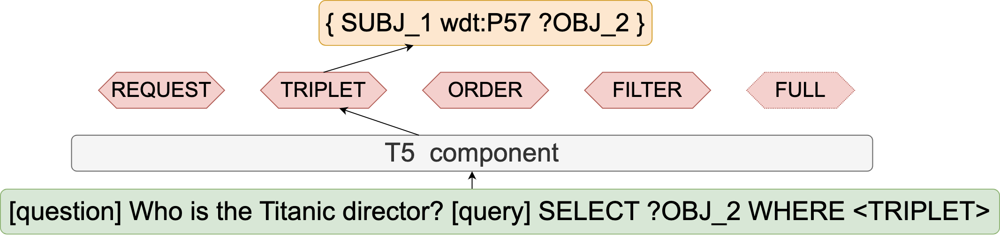

### Code for Multi-task training for better generalization in Structured Query Languages 

In this project we evaluate semantic parser ability towards compositional generalization with classic model fine-tuning
(empirical risk minimization) and multi-task (MT) approaches.



#### Project Structure

```
configs - folder with configs for ERM/MT run including model parameters, data sources, and inference settings
dataset - folder with processed splits for evaluation for LCQUAD and for WikiSQL
eval_metrics - folder with evaluation methods of results of semantic parser
experiements - folder with predictions for paper
models - folder with model architecture for ERM and MT approaches
notebooks - folder with notebooks for analsyis of predictions 
original_datasets - folder with merged LCQUAD and WikiSQL datasets
split_logic - folder with methods for distribution shift splitting
target_tokenizer - folder with tokenizers for text-to-query task
```


#### Run training

In order to reproduce experiments, you need Python 3.9 with libraries from requirements.txt. 
For training/inference set up environment variables:

`export PROJECT_PATH=path to this project`

* To train/infer MT approach select desired config from configs folder
  * `python mt_train.py --config_name mt_tmcd_t5_config.yaml`
  * `python mt_predict.py --config_name mt_tmcd_t5_config.yaml`

* To train/infer ERM approach select desired config from configs folder
  * `python erm_train.py --config_name erm_tmcd_t5_config.yaml`
  * `python erm_predict.py --config_name erm_tmcd_t5_config.yaml`
  
#### Splits running

The prepared splits are in ``dataset`` folder. 

If you want to make split yourself, load original dataset splits:

* WikiSQL: https://github.com/salesforce/WikiSQL
* LcQuad: https://github.com/AskNowQA/LC-QuAD2.0

Merge training, dev and test data in one JSON file and point the path to them in ``split_logic/tmcd_split/config.yaml``

Set up environment variables:

`export PROJECT_PATH=path to this project`

Set up config for the desired split and run split strategy:

`python split_logic/tmcd_split/make_tmcd_split.py`
